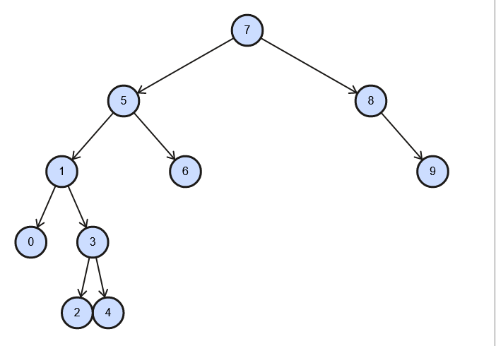

# [7, 5, 1, 8, 3, 6, 0, 9, 4, 2] dizisinin Binary-Search-Tree aşamalarını yazınız.

* root 7'dir. 5, 7'nin soluna gider. 
* 1, hem 7'nin hem de 5'in soluna gider.      
* 8, 7'nin sağına gider.    
* 3, 7 ve 5'in soluna gider fakat 1'in sağına gider.
* 6, 7'nin soluna ve 5'in sağına gider.
* 0, tamamen sola gider.
* 9, tamamen sağa gider.
* 4, 7 ve 5'in soluna, 1 ve 3'ün sağına gider.
* 2, 7 ve 5'in soluna, 1'in sağına ve 3'ün soluna gider.

